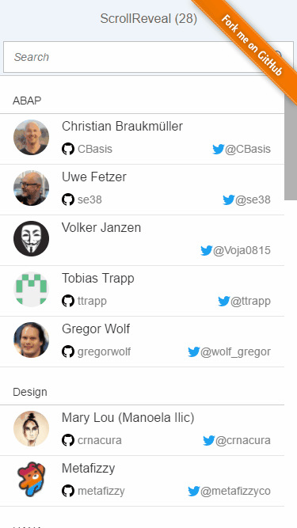

# ScrollReveal

## [OpenUI5 Developer Blog](http://openui5.blogspot.com/2017/03/scrollreveal.html)

> [UI5](http://openui5.org/) demo showing a list with [ScrollReveal](https://scrollrevealjs.org/) animations during scrolling.

### [Online Demo (SAP HCP)](https://scrollreveal-p1940953245trial.dispatcher.hanatrial.ondemand.com/index.html)

The demo is a UI5 wrapper for the ScrollReveal project
[ScrollReveal Git Repository](https://github.com/jlmakes/scrollreveal)

The code uses most up-to-date browser features and is highly experimental (not thought to be used for productive apps).
It should only demonstrate some browser features and be a nice giveaway for XMas.

### Highlights

> - custom control to extend sap.m.List
> - support of binding and growing by resyncing dom elements
> - using JSON model initialized inside manifest.json

## License

Showdown is released under the [Apache license](http://www.apache.org/licenses/). Have at it.